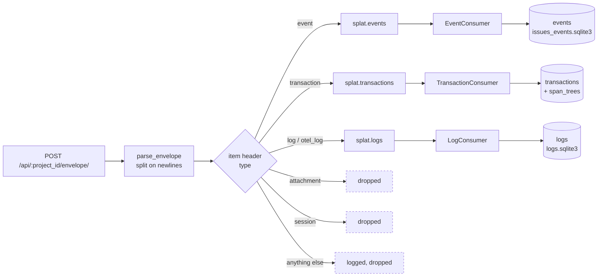
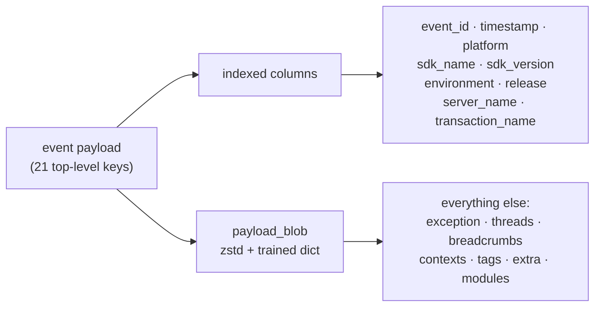

# The Sentry payload, as Splat sees it

What actually arrives at `POST /api/:project_id/envelope/`, and what Splat does
with it. The full spec is [`envelopes.md`](envelopes.md) — this is the subset we
handle, drawn from real payloads rather than from the spec's examples.

Two things trip people up, and they're worth stating before the diagrams:

1. **An envelope is not JSON.** It's newline-delimited JSON — several independent
   documents stacked in one request body. Parsing it as a single object fails.
2. **One envelope carries many items, of different types.** An error event and a
   batch of logs can arrive in the same POST and go to different tubes.

## 1. The wire format

Newline-delimited. Line 1 is the envelope header; then each item is a header line
followed by a payload line. The `length` in an item header is the payload's byte
count, which is how a reader finds the next item without parsing the payload.

```
{"event_id":"9ec79c33ec9942ab8353589fcb2e04dc","sent_at":"2026-07-17T10:00:00Z"}  ← envelope header
{"type":"event","length":41236}                                                    ← item 1 header
{"event_id":"9ec79c33…","exception":{…},"breadcrumbs":{…}, …}                      ← item 1 payload
{"type":"log","length":892}                                                        ← item 2 header
{"items":[{…},{…}]}                                                                ← item 2 payload
```

The envelope header carries `event_id` and `sent_at`; items carry their own type
and length. Note the `event_id` appears in **both** the envelope header and the
event payload — Splat prefers the payload's and falls back to the envelope's
(`envelope_processor.rb:208`), following GlitchTip.

## 2. What Splat does with each item

Five item types reach `process_item`. Three are stored, two are deliberately
dropped. Each stored type is queued to its own tube and drained by its own
consumer into its own database.



Three gates sit in front of storage, all in `process_item`:

- **`setting.store_events?` / `store_transactions?` / `store_logs?`** — each type
  can be switched off; the item is dropped at ingest, before the tube.
- **`housekeeping_transaction?(name)`** — drops Splat's own noise transactions so
  the instance doesn't fill up watching itself.
- **Missing `event_id`** — events and transactions are dropped and logged. Logs
  are handled *before* this guard, because a log item is a batch (`items: [...]`)
  with no single id.

## 3. The event payload

21 top-level keys on a real Booko event. Grouped by what they're for, rather than
alphabetically as they arrive:

```
identity      event_id          "9ec79c33ec9942ab8353589fcb2e04dc"
              timestamp         String (ISO8601 or epoch float — parse both)
              type              "event"
              level             "error" | "warning" | …
              platform          "ruby"

deployment    release           app version
              environment       "production"
              server_name       which box sent it

the error     exception.values[]        ← usually 1, more when causes are chained
                .type                   "NoMethodError"
                .value                  the message
                .module                 namespace
                .thread_id
                .mechanism              {type, handled}
                .stacktrace.frames[]    ← 65 frames on the sample event
              threads.values[]          ← {id, crashed, current, stacktrace}

grouping      fingerprint       [] — usually empty; Splat derives one (§6)
              transaction       "ProductsController#show"
              transaction_info  {source}

context       contexts.os       {name, version, build, kernel_version, machine}
              contexts.runtime  {name, version}
              contexts.trace    {trace_id, span_id, parent_span_id, op,
                                 status, origin, data}      ← links to a transaction
              user              {} — empty on Booko
              tags              {job_id, provider_job_id, …}
              extra             {active_job, arguments, scheduled_at, …}
              modules           {158 keys}  ← the entire Gemfile.lock (§5)

trail         breadcrumbs.values[]  {category, message, level, timestamp,
                                     type, data}

sdk           sdk               {name, version}
```

`contexts.trace.trace_id` is the join to performance data — the same trace_id
appears on the transaction, which is how an error and the request that caused it
are linked.

## 4. A stack frame

`exception.values[0].stacktrace.frames[]` is where the bulk of an error payload
lives — 65 frames on the sample event, each carrying source context:

```
abs_path        "/app/controllers/products_controller.rb"   full path
filename        "app/controllers/products_controller.rb"    relative
function        "ProductsController#show"
lineno          42
in_app          true          ← your code vs a gem. Drives the UI's default view.
pre_context     [3 lines]     ← source lines before
context_line    "  @product = Product.find(params[:id])"    ← the line itself
post_context    [3 lines]     ← source lines after
```

Frames are ordered **oldest first** — the innermost call is the *last* frame, not
the first. Splat's fingerprinting uses `frames[-1]` for exactly this reason (§6).

`pre_context` / `context_line` / `post_context` mean each frame carries 7 lines of
source. That's why frames dominate the payload, and why they compress so well —
neighbouring events from the same code repeat nearly identical text.

## 5. Where the bytes go

Structure from real payloads; proportions vary hugely by event, so treat these as
the shape of the problem, not constants:

| Part | What it is |
|---|---|
| `exception` + `threads` | Stack frames with 7 lines of source each. The bulk. |
| `modules` | 158 gem→version pairs. **Identical on every event from a release.** |
| `contexts`, `tags`, `extra` | Small, but present on every event. |
| `breadcrumbs` | Usually small; grows with app instrumentation. |

`modules` is the clearest illustration of why dictionary compression earns its
keep here: the same 158 gem names and versions ride along on *every single event*
from a given release. It's near-pure redundancy across rows, which is exactly
what a trained zstd dictionary eats — and why `events` gets ~6× (see the
compression figures on the settings page).

## 6. What Splat extracts, and what stays in the blob

Only nine fields become columns. Everything else stays in the compressed payload
blob and is read back on demand.



The mapping is `Event.create_from_sentry_payload!` (`app/models/event.rb:38`):

| Column | Source |
|---|---|
| `platform` | `payload["platform"]` |
| `sdk_name` / `sdk_version` | `payload.dig("sdk", "name"/"version")` |
| `environment` / `release` / `server_name` | top-level keys of the same name |
| `transaction_name` | `payload["transaction"]` |
| `timestamp` | `parse_timestamp(payload["timestamp"])` — handles both forms |
| `payload` | the whole thing, compressed |

**Grouping happens at ingest, not at query time.** `Issue.group_event`
(`app/models/issue.rb:39`) derives a fingerprint and finds-or-creates the issue
before the event row is written. It prefers the SDK's `payload["fingerprint"]`
when present; Booko's SDK sends `[]`, so in practice Splat derives one from the
exception type and the innermost frame's file and line — which is why `frames[-1]`
in §4 matters, and why a stack that shifts by one line can create a new issue.

## Reading a real one yourself

Structure, no values — safe to paste into a terminal, nothing sensitive printed:

```ruby
# bin/rails runner
e = Event.order(id: :desc).first
puts e.payload.keys.sort                                  # top-level shape
puts e.payload.dig("exception", "values", 0, "type")      # the error class
puts e.payload.dig("exception","values",0,"stacktrace","frames").size
puts e.payload["modules"].keys.size                        # the Gemfile.lock rider
```

## See also

- [`envelopes.md`](envelopes.md) — the full upstream envelope spec.
- [`../decisions/0002-legacy-spans-drop.md`](../decisions/0002-legacy-spans-drop.md)
  — how transaction spans are stored (one zstd blob per trace tree).
- `app/services/sentry_protocol/envelope_processor.rb` — the parser and the
  routing in §2.
